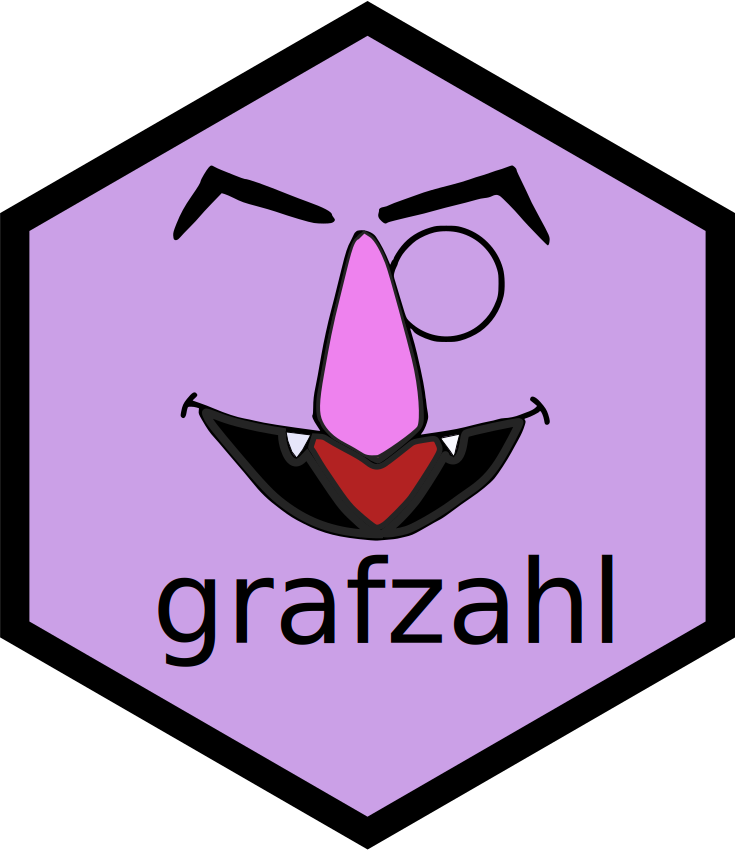

<!-- README.md is generated from README.Rmd. Please edit that file -->

# grafzahl 

<!-- badges: start -->

[](https://CRAN.R-project.org/package=grafzahl)
<!-- badges: end -->

The goal of grafzahl (**G**racious **R** **A**nalytical **F**ramework
for **Z**appy **A**nalysis of **H**uman **L**anguages \[1\]) is to duct
tape the [quanteda](https://github.com/quanteda/quanteda) ecosystem to
modern [Transformer-based text classification
models](https://simpletransformers.ai/), e.g. BERT, RoBERTa, etc. The
model object looks and feels like the textmodel S3 object from the
package
[quanteda.textmodels](https://github.com/quanteda/quanteda.textmodels).

If you don’t know what I am talking about, don’t worry, this package is
gracious. You don’t need to know a lot about Transformers to use this
package. See the examples below.

Please cite this software as:

Chan, C., (2023). [grafzahl: fine-tuning Transformers for text data from
within R](paper/grafzahl_sp.pdf). *Computational Communication Research*
(Accepted)

## Installation

You can install the development version of grafzahl like so:

``` r
remotes::install_github("chainsawriot/grafzahl")
```

Or, you can install the CRAN version

``` r
install.packages("grafzahl")
```

After that, you need to setup your conda environment

``` r
require(grafzahl)
setup_grafzahl(cuda = TRUE) ## if you have GPU(s)
```

## Usage

Suppose you have a bunch of tweets in quanteda corpus format. And the
corpus has exactly one docvar that denotes the labels you want to
predict. The data is from [this
repository](https://github.com/pablobarbera/incivility-sage-open)
(Theocharis et al., 2020).

``` r
unciviltweets
#> Corpus consisting of 19,982 documents and 1 docvar.
#> text1 :
#> "@ @ Karma gave you a second chance yesterday.  Start doing m..."
#> 
#> text2 :
#> "@ With people like you, Steve King there's still hope for we..."
#> 
#> text3 :
#> "@ @ You bill is a joke and will sink the GOP. #WEDESERVEBETT..."
#> 
#> text4 :
#> "@ Dream on. The only thing trump understands is how to enric..."
#> 
#> text5 :
#> "@ @ Just like the Democrat taliban party was up front with t..."
#> 
#> text6 :
#> "@ you are going to have more of the same with HRC, and you a..."
#> 
#> [ reached max_ndoc ... 19,976 more documents ]
```

In order to train a Transfomer model, please select the `model_name`
from [Hugging Face’s list](https://huggingface.co/models). The table
below lists some common choices. In most of the time, providing
`model_name` is sufficient, there is no need to provide `model_type`.

Suppose you want to train a Transformer model using “bertweet” (Nguyen
et al., 2020) because it matches your domain of usage. By default, it
will save the model in the `output` directory of the current directory.
You can change it to elsewhere using the `output_dir` parameter.

``` r
model <- grafzahl(unciviltweets, model_type = "bertweet", model_name = "vinai/bertweet-base")
### If you are hardcore quanteda user:
## model <- textmodel_transformer(unciviltweets,
##                                model_type = "bertweet", model_name = "vinai/bertweet-base")
```

Make prediction

``` r
predict(model)
```

That is it.

## Extended examples

Several extended examples are also available.

| Examples                                        | file                                           |
| ----------------------------------------------- | ---------------------------------------------- |
| van Atteveldt et al. (2021)                     | [paper/vanatteveldt.md](paper/vanatteveldt.md) |
| Dobbrick et al. (2021)                          | [paper/dobbrick.md](paper/dobbrick.md)         |
| Theocharis et al. (2020)                        | [paper/theocharis.md](paper/theocharis.md)     |
| OffensEval-TR (2020)                            | [paper/coltekin.md](paper/coltekin.md)         |
| Amharic News Text classification Dataset (2021) | [paper/azime.md](paper/azime.md)               |

## Some common choices of `model_name`

| Your data         | model\_type | model\_name                        |
| ----------------- | ----------- | ---------------------------------- |
| English tweets    | bertweet    | vinai/bertweet-base                |
| Lightweight       | mobilebert  | google/mobilebert-uncased          |
|                   | distilbert  | distilbert-base-uncased            |
| Long Text         | longformer  | allenai/longformer-base-4096       |
|                   | bigbird     | google/bigbird-roberta-base        |
| English (General) | bert        | bert-base-uncased                  |
|                   | bert        | bert-base-cased                    |
|                   | electra     | google/electra-small-discriminator |
|                   | roberta     | roberta-base                       |
| Multilingual      | xlm         | xlm-mlm-17-1280                    |
|                   | xml         | xlm-mlm-100-1280                   |
|                   | bert        | bert-base-multilingual-cased       |
|                   | xlmroberta  | xlm-roberta-base                   |
|                   | xlmroberta  | xlm-roberta-large                  |

# References

1.  Theocharis, Y., Barberá, P., Fazekas, Z., & Popa, S. A. (2020). The
    dynamics of political incivility on Twitter. Sage Open, 10(2),
    2158244020919447.
2.  Nguyen, D. Q., Vu, T., & Nguyen, A. T. (2020). BERTweet: A
    pre-trained language model for English Tweets. arXiv preprint
    arXiv:2005.10200.

-----

1.  Yes, I totally made up the meaningless long name. Actually, it is
    the German name of the *Sesame Street* character [Count von
    Count](https://de.wikipedia.org/wiki/Sesamstra%C3%9Fe#Graf_Zahl),
    meaning “Count (the noble title) Number”. And it seems to be so that
    it is compulsory to name absolutely everything related to
    Transformers after Seasame Street characters.
