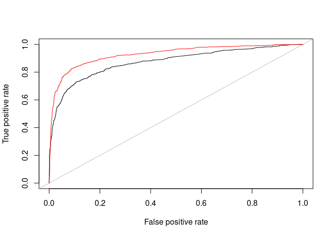

Theocharis et al. (2020)
================

The following is to analyse the same data used in Theocharis et
al. (2020) “The Dynamics of Political Incivility on Twitter”
\[[doi](https://doi.org/10.1177/2158244020919447)\]. The data is
available from [Professor Pablo Barberá’s
Github](https://github.com/pablobarbera/incivility-sage-open).

# Data and Lasso regression

The dataset `unciviltweets` is available in this package by agreement of
Professor Pablo Barberá. The dataset bundled in this package is a
quanteda corpus of 19,982 tweets and a single docvar of incivility, the
label to be predicted.

The following attempts to train the [lasso incivility
classifier](https://github.com/pablobarbera/incivility-sage-open/blob/master/02-classifier.R)
in the original paper.

## Creation of train-test split

Preprocessing

``` r
require(quanteda)
#> Loading required package: quanteda
#> Package version: 3.2.2
#> Unicode version: 13.0
#> ICU version: 66.1
#> Parallel computing: 16 of 16 threads used.
#> See https://quanteda.io for tutorials and examples.
require(grafzahl)
require(caret)
#> Loading required package: caret
#> Loading required package: ggplot2
#> Loading required package: lattice
require(glmnet)
#> Loading required package: glmnet
#> Loading required package: Matrix
#> Loaded glmnet 4.1-4
require(pROC)
#> Loading required package: pROC
#> Type 'citation("pROC")' for a citation.
#> 
#> Attaching package: 'pROC'
#> The following objects are masked from 'package:stats':
#> 
#>     cov, smooth, var

uncivildfm <- unciviltweets %>% tokens(remove_url = TRUE, remove_numbers = TRUE) %>% tokens_wordstem() %>% dfm() %>% dfm_remove(stopwords("english")) %>% dfm_trim(min_docfreq = 2)
y <- docvars(unciviltweets)[,1]
seed <- 123
set.seed(seed)
training <- sample(seq_along(y), floor(.80 * length(y)))
test <- (seq_along(y))[seq_along(y) %in% training == FALSE]
```

A “downsample” process was introduced in the original paper.

``` r
small_class <- which.min(table(y[training])) - 1
n_small_class <- sum(y[training] == small_class)
downsample <- sample(training[y[training] != small_class], n_small_class, replace = TRUE)
training <- c(training[y[training] == small_class], downsample)
original_training <- setdiff(seq_along(y), test) ## retain a copy
```

## Training a lasso classifier

Confusion matrix

``` r
X <- as(uncivildfm, "dgCMatrix")

lasso <- glmnet::cv.glmnet(x = X[training,], y = y[training], alpha = 1, nfold = 5, family = "binomial")
```

### Evaluation

``` r
preds <- predict(lasso, uncivildfm[test,], type="response")
caret::confusionMatrix(table(y[test], ifelse(preds > .5, 1, 0)), mode = "prec_recall")
#> Confusion Matrix and Statistics
#> 
#>    
#>        0    1
#>   0 2929  384
#>   1  183  501
#>                                           
#>                Accuracy : 0.8581          
#>                  95% CI : (0.8469, 0.8688)
#>     No Information Rate : 0.7786          
#>     P-Value [Acc > NIR] : < 2.2e-16       
#>                                           
#>                   Kappa : 0.5522          
#>                                           
#>  Mcnemar's Test P-Value : < 2.2e-16       
#>                                           
#>               Precision : 0.8841          
#>                  Recall : 0.9412          
#>                      F1 : 0.9118          
#>              Prevalence : 0.7786          
#>          Detection Rate : 0.7328          
#>    Detection Prevalence : 0.8289          
#>       Balanced Accuracy : 0.7536          
#>                                           
#>        'Positive' Class : 0               
#> 
```

ROC

``` r
pROC::auc(as.vector((y[test])*1), as.vector((preds)*1))
#> Setting levels: control = 0, case = 1
#> Setting direction: controls < cases
#> Area under the curve: 0.8734
```

## Training a BERTweet classifier

In this example, a BERTweet-based classifier (Nguyen et al. 2020) is
trained. Please note that the following doesn’t involve the
preprocessing and downsampling procedures.

``` r
set.seed(721)
model <- grafzahl(unciviltweets[original_training], model_type = "bertweet", model_name = "vinai/bertweet-base", output_dir = here::here("paper/theocharis"))
```

### Evaluation

``` r
pred_bert <- predict(model, unciviltweets[test])
pred_bert2 <- predict(model, unciviltweets[test], return_raw = TRUE)

caret::confusionMatrix(table(y[test], pred_bert), mode = "prec_recall")
#> Confusion Matrix and Statistics
#> 
#>    pred_bert
#>        0    1
#>   0 3162  151
#>   1  186  498
#>                                           
#>                Accuracy : 0.9157          
#>                  95% CI : (0.9066, 0.9241)
#>     No Information Rate : 0.8376          
#>     P-Value [Acc > NIR] : < 2e-16         
#>                                           
#>                   Kappa : 0.6966          
#>                                           
#>  Mcnemar's Test P-Value : 0.06401         
#>                                           
#>               Precision : 0.9544          
#>                  Recall : 0.9444          
#>                      F1 : 0.9494          
#>              Prevalence : 0.8376          
#>          Detection Rate : 0.7911          
#>    Detection Prevalence : 0.8289          
#>       Balanced Accuracy : 0.8559          
#>                                           
#>        'Positive' Class : 0               
#> 
```

### ROC

``` r
pROC::auc(as.vector((y[test])*1), pred_bert2[,1])
#> Setting levels: control = 0, case = 1
#> Setting direction: controls > cases
#> Area under the curve: 0.9274
```

### Plotting the two curves

``` r
require(ROCR)
#> Loading required package: ROCR
performance_bert <- performance(prediction(pred_bert2[,2], y[test]), "tpr", "fpr")
performance_origin <- performance(prediction(preds, y[test]), "tpr", "fpr")
plot(performance_origin)
abline(a = 0, b = 1, col = "grey")
plot(performance_bert, add = TRUE, col = "red")
```



## References

1.  Nguyen, D. Q., Vu, T., & Nguyen, A. T. (2020). BERTweet: A
    pre-trained language model for English Tweets. arXiv preprint
    arXiv:2005.10200.
