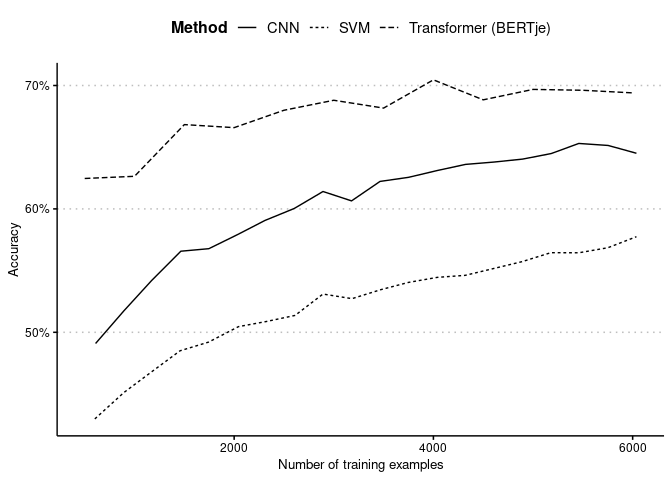

van Atteveldt et al. (2021)
================

The following is to analyse the same data used in van Atteveldt et
al. (2021) “The Validity of Sentiment Analysis: Comparing Manual
Annotation, Crowd-Coding, Dictionary Approaches, and Machine Learning
Algorithms” \[[doi](https://doi.org/10.1080/19312458.2020.1869198)\].
The data is available from this [github
repo](https://github.com/vanatteveldt/ecosent).

# Read the data directly from Github using `readtext`

``` r
require(quanteda)
#> Loading required package: quanteda
#> Package version: 3.2.2
#> Unicode version: 13.0
#> ICU version: 66.1
#> Parallel computing: 16 of 16 threads used.
#> See https://quanteda.io for tutorials and examples.
require(grafzahl)
#> Loading required package: grafzahl
require(readtext)
#> Loading required package: readtext
url <- "https://raw.githubusercontent.com/vanatteveldt/ecosent/master/data/intermediate/sentences_ml.csv"
input <- readtext(url, text_field = "headline") %>% corpus
training_corpus <- corpus_subset(input, !gold)
```

# Training

In this analysis, [the Dutch language BERT
(BERTje)](https://huggingface.co/GroNLP/bert-base-dutch-cased) is used.

``` r
model <- grafzahl(x = training_corpus, y = "value", model_name = "GroNLP/bert-base-dutch-cased",
                  output_dir = here::here("paper/va_output"), manual_seed = 721)
saveRDS(model, here::here("paper/va_model.RDS"))
```

# Make prediction for the test set

``` r
model <- readRDS(here::here("paper/va_model.RDS"))
test_corpus<- corpus_subset(input, gold)
predicted_sentiment <- predict(model, newdata = test_corpus)
```

# Confusion matrix

``` r
mt <- table(predicted_sentiment, gt = docvars(test_corpus, "value"))
caret::confusionMatrix(mt, mode = "prec_recall")
#> Confusion Matrix and Statistics
#> 
#>                    gt
#> predicted_sentiment -1  0  1
#>                  -1 81 27  6
#>                  0  14 74 18
#>                  1   4 11 49
#> 
#> Overall Statistics
#>                                           
#>                Accuracy : 0.7183          
#>                  95% CI : (0.6621, 0.7699)
#>     No Information Rate : 0.3944          
#>     P-Value [Acc > NIR] : <2e-16          
#>                                           
#>                   Kappa : 0.5699          
#>                                           
#>  Mcnemar's Test P-Value : 0.1018          
#> 
#> Statistics by Class:
#> 
#>                      Class: -1 Class: 0 Class: 1
#> Precision               0.7105   0.6981   0.7656
#> Recall                  0.8182   0.6607   0.6712
#> F1                      0.7606   0.6789   0.7153
#> Prevalence              0.3486   0.3944   0.2570
#> Detection Rate          0.2852   0.2606   0.1725
#> Detection Prevalence    0.4014   0.3732   0.2254
#> Balanced Accuracy       0.8199   0.7373   0.8001
```

# LIME

Explaining the prediction using Local Interpretable Model-agnostic
Explanations (LIME).

``` r
require(lime)
sentences <- c("Dijsselbloem pessimistisch over snelle stappen Grieken",
               "Aandelenbeurzen zetten koersopmars voort")
explainer <- lime(training_corpus, model)
explanations <- explain(sentences, explainer, n_labels = 1,
                        n_features = 5)
plot_text_explanations(explanations)
```

You should see something like this:


# Learning curve

van Atteveldt et al. (2021) present also the learning curves for CNN and
SVM. Let’s overlay the learning curve for BERTje here.

## Training using different training sizes

``` r
n <- rep(seq(500, 6000, by = 500), 10)
res <- list()
test_corpus<- corpus_subset(input, gold)
set.seed(721831)
for (i in seq_along(n)) {
    current_corpus <- corpus_sample(training_corpus, n[i])
    model <- grafzahl(x = current_corpus, y = "value", model_name = "GroNLP/bert-base-dutch-cased", output_dir = here::here("paper/va_size"))
        predicted_sentiment <- predict(model, newdata = test_corpus)
    res[[i]] <- caret::confusionMatrix(table(predicted_sentiment, gt = docvars(test_corpus, "value")), mode = "prec_recall")
}
saveRDS(res, here::here("paper/va_learning.RDS"))
```

## Plotting

``` r
require(tidyverse)
n <- rep(seq(500, 6000, by = 500), 10)
res <- readRDS(here::here("paper/va_learning.RDS"))
acc <- purrr::map_dbl(res, ~.$overall['Accuracy'])

## Downright stole from Van Atteveldt.
## Except their Amsterdam style of R programming.
## https://github.com/vanatteveldt/ecosent/blob/36b84628ec908666ea8280593cb335c89c4e5e7e/src/analysis/performance.md

url_cnn <- "https://raw.githubusercontent.com/vanatteveldt/ecosent/master/data/intermediate/cnn_curve.csv"
url_svm <- "https://raw.githubusercontent.com/vanatteveldt/ecosent/master/data/intermediate/svm_curve.csv"

curve <- rbind(readr::read_csv(url_cnn) %>% add_column(method="CNN", .before=1),
               readr::read_csv(url_svm) %>% add_column(method="SVM", .before=1)) %>%
    group_by(method, perc) %>% summarize(n=mean(n), acc=mean(acc)) %>% ungroup

tibble::tibble(n, acc, method = "Transformer (BERTje)", perc = 0) %>% group_by(method, n) %>%
    summarise(acc = mean(acc)) %>% ungroup %>% add_column(perc = 1, .before = "n") %>%
    bind_rows(curve) -> curve

ggplot(curve, aes(x=n, y=acc, group=method, lty=method)) + geom_line() + 
  scale_linetype(name="Method") +
  xlab("Number of training examples") + ylab("Accuracy") + 
  scale_y_continuous(labels = scales::percent_format(accuracy = 1))+
  ggthemes::theme_clean() + theme(legend.position = "top", legend.background = element_blank(),
                                  plot.background  = element_blank())
```

<figure>

<figcaption aria-hidden="true">Learning curve of machine learning
algorithms</figcaption>
</figure>
